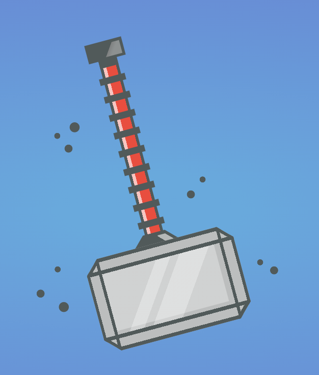
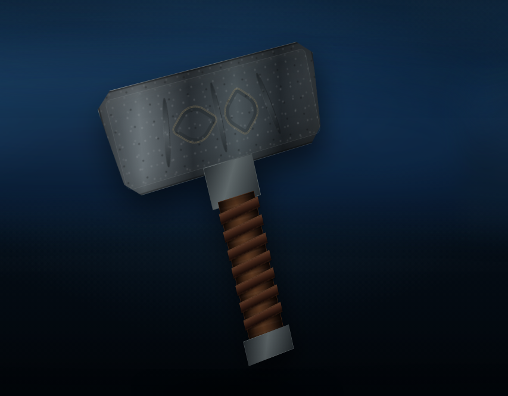

# Mjölnir CSS — Storm-Forged V2

A complete visual and technical evolution of the original **Mjolnir-CSS** project, rebuilt as a lightweight pseudo-3D Mjölnir experience with an animated storm atmosphere.

The final V2 update also improves typography and readability across desktop, tablet and mobile screens while keeping the project fully compatible with GitHub Pages.

## V1 — Original CSS Illustration



The original version was a stylized 2D CSS drawing. It established the core idea of creating Mjölnir with web technologies, but the scene was intentionally simple: a flat blue background, geometric hammer construction, limited depth and no interactive storm system.

### V1 characteristics

- 2D CSS illustration.
- Flat geometric construction.
- Static blue background.
- No JavaScript-driven visual effects.
- No interactive lightning.
- Minimal depth and lighting.
- Simple presentation focused on the hammer itself.

## V2 — Storm-Forged Mjölnir



V2 keeps the original project's CSS-art spirit, but rebuilds the hammer as a more substantial pseudo-3D object and turns the page into an interactive storm scene.

### Main V2 improvements

- Rebuilt Mjölnir using CSS `perspective`, `transform-style: preserve-3d` and multiple Z-axis faces.
- Redesigned the silhouette toward a compact, short-handled myth-inspired hammer.
- Added forged-iron surfaces, bevels, wear, ornamental details and a wrapped grip.
- Added pointer-based parallax so the hammer reacts to mouse movement with a stronger sense of depth.
- Added layered animated clouds, mist, atmospheric illumination and vignette effects.
- Added procedural JavaScript lightning inspired by the Storm project: midpoint displacement, branches, multi-pass glow and return strokes.
- Clicking Mjölnir summons a lightning strike directly onto the hammer.
- Added automatic quality reductions for lower-power/mobile devices.
- Added `prefers-reduced-motion` support.
- Kept the project framework-free and suitable for GitHub Pages.

## Final V2 typography update

The final update focuses on making the interface feel more consistent with the Norse-inspired visual direction **without sacrificing readability**.

- Added **Cinzel Decorative** to the main `MJÖLNIR` title for a carved, ancient-display appearance.
- Added **Cinzel** to supporting text for a consistent historic/fantasy character while remaining readable.
- Added subtle Elder Futhark-inspired decorative glyphs above the title as visual ornament only.
- Increased contrast on the title, subtitle, eyebrow and interaction hint.
- Added a dark translucent backing behind the title area so lightning flashes and moving clouds do not wash out the text.
- Added stronger but restrained text shadows for readability against bright storm effects.
- Improved typography with responsive `clamp()` sizing instead of fixed text sizes.
- Reduced letter spacing on small screens to prevent text from becoming compressed or overflowing.
- Improved the bottom interaction hint with a responsive translucent container.
- Added dedicated rules for phones below 760 px, 480 px and 380 px.
- Added a compact landscape layout for devices with limited vertical height.
- Included safe-area spacing for modern mobile screens.

> The web fonts are loaded from Google Fonts. If they cannot be reached, the CSS automatically falls back to serif system fonts so the page remains usable.

## V1 vs V2

| Area | V1 | V2 |
| --- | --- | --- |
| Hammer | Flat 2D CSS illustration | Multi-face pseudo-3D CSS object |
| Visual direction | Simple geometric design | Dark forged, myth-inspired design |
| Handle | Long, bright stylized handle | Shorter wrapped grip |
| Background | Static blue | Animated storm atmosphere |
| Lightning | None | Procedural JavaScript lightning |
| Interaction | Static | Pointer parallax + click-to-summon lightning |
| Depth | Minimal | Perspective and Z-axis faces |
| Typography | Basic presentation | Norse-inspired display typography |
| Readability | Basic | Contrast-backed responsive text |
| Mobile | Simple scaling | Dedicated responsive typography and layout |
| Performance | Lightweight | Still lightweight, with adaptive quality |

## Project files

Everything is intentionally kept in the repository root so it can be uploaded directly through **GitHub → Add file → Upload files**.

```text
index.html
style.css
script.js
README.md
mjolnir-v1.png
mjolnir-v2.png
```

## Run locally

You can open `index.html` directly in a modern browser or run a small local server:

```bash
python3 -m http.server 8080
```

Then open:

```text
http://localhost:8080
```

## GitHub Pages

The project is static and can be deployed directly with GitHub Pages. Upload all files above to the root of the existing repository, replacing the old `index.html`, CSS and JavaScript files when GitHub asks.

## Historical direction

This project is **myth-inspired rather than an archaeological reconstruction**. The design uses the literary description of Mjölnir having an unusually short handle and the compact visual character seen in Viking Age Mjölnir amulets as broad inspiration. The final proportions, grip treatment and large-scale 3D presentation remain artistic choices for the web experience.
